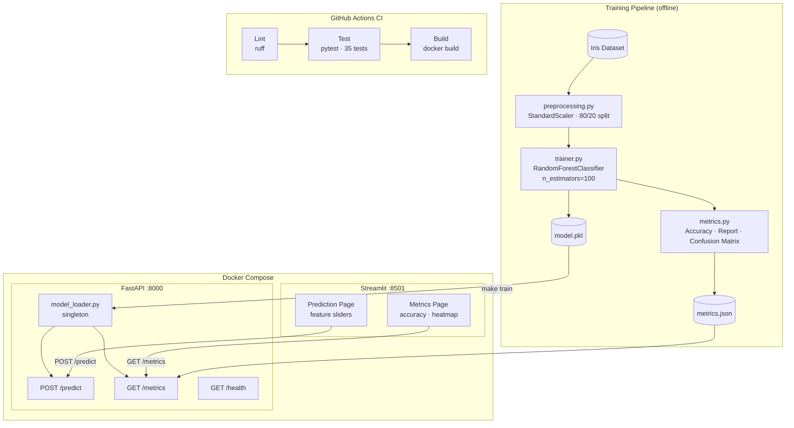

# Iris ML System

A production-ready end-to-end machine learning system for Iris flower classification. Includes a trained model pipeline, REST API, interactive frontend, containerized deployment, and a full test suite.

## Overview

| Component | Technology | Port |
|---|---|---|
| ML Pipeline | scikit-learn (RandomForest) | — |
| REST API | FastAPI + Uvicorn | 8000 |
| Frontend | Streamlit | 8501 |
| Containerization | Docker + docker-compose | — |
| CI/CD | GitHub Actions | — |
| Tests | pytest (35 tests) | — |

## Architecture



## Project Structure

```
ml_system/
├── api/                        # FastAPI application
│   ├── main.py                 # Routes: /health, /predict, /metrics
│   ├── schemas.py              # Pydantic request/response models
│   └── model_loader.py         # Singleton model loader
├── frontend/
│   └── app.py                  # Streamlit UI
├── src/
│   ├── data/preprocessing.py   # Data loading, scaling, train/test split
│   ├── models/trainer.py       # RandomForestClassifier training
│   ├── models/config.py        # Hyperparameter config
│   └── evaluation/metrics.py   # Accuracy, classification report, confusion matrix
├── scripts/
│   └── train.py                # End-to-end training script
├── tests/
│   ├── conftest.py             # Shared fixtures
│   ├── unit/                   # Unit tests (model, preprocessing, schemas)
│   └── integration/            # API integration tests
├── artifacts/                  # Generated: model.pkl, metrics.json
├── .github/workflows/ci.yml    # GitHub Actions: lint → test → build
├── Dockerfile                  # Multi-stage: trainer → api
├── docker-compose.yml          # API + frontend services
└── Makefile                    # Convenience commands
```

## Quickstart

### Local (without Docker)

**1. Install dependencies**
```bash
pip install -r requirements.txt
```

**2. Train the model**
```bash
make train
# Generates: artifacts/model.pkl, artifacts/metrics.json
```

**3. Start the API**
```bash
make serve
# Running at http://localhost:8000
```

**4. Start the frontend** (new terminal)
```bash
make frontend
# Running at http://localhost:8501
```

### Docker

```bash
make docker-up
# API:      http://localhost:8000
# Frontend: http://localhost:8501

make docker-down  # tear down
```

## API Reference

### `GET /health`
```json
{ "status": "healthy" }
```

### `GET /metrics`
Returns model evaluation metrics from `artifacts/metrics.json`.
```json
{
  "accuracy": 1.0,
  "classification_report": { ... },
  "confusion_matrix": [ ... ]
}
```

### `POST /predict`
**Request:**
```json
{ "features": [5.1, 3.5, 1.4, 0.2] }
```
Features order: `sepal length`, `sepal width`, `petal length`, `petal width` (in cm)

**Response:**
```json
{
  "prediction": "setosa",
  "probability": [0.97, 0.02, 0.01]
}
```

**Example with curl:**
```bash
curl -X POST http://localhost:8000/predict \
  -H "Content-Type: application/json" \
  -d '{"features": [5.1, 3.5, 1.4, 0.2]}'
```

## Frontend

The Streamlit app at `http://localhost:8501` has two pages:

- **Predict** — adjust sliders for the 4 Iris features and click Predict to see the classification result and probability chart
- **Metrics** — view model accuracy, per-class classification report, and confusion matrix heatmap

## Running Tests

```bash
make test
# or
pytest tests/ -v
```

35 tests across unit and integration suites. Tests cover preprocessing, model training, evaluation, Pydantic schemas, and all API endpoints.

## Model

- **Algorithm:** RandomForestClassifier (`n_estimators=100`, `random_state=42`)
- **Dataset:** Iris (150 samples, 4 features, 3 classes)
- **Preprocessing:** StandardScaler, 80/20 train/test split
- **Test accuracy:** 100%
- **Classes:** setosa, versicolor, virginica

## CI/CD

GitHub Actions workflow (`.github/workflows/ci.yml`) runs on every push and pull request to `main`:

1. **Lint** — `ruff check`
2. **Test** — `pytest tests/`
3. **Build** — `docker build`

## Makefile Reference

| Command | Description |
|---|---|
| `make train` | Train model and save artifacts |
| `make serve` | Start FastAPI on port 8000 |
| `make frontend` | Start Streamlit on port 8501 |
| `make test` | Run pytest suite |
| `make lint` | Run ruff linter |
| `make docker-up` | Build and start all services |
| `make docker-down` | Stop all services |
